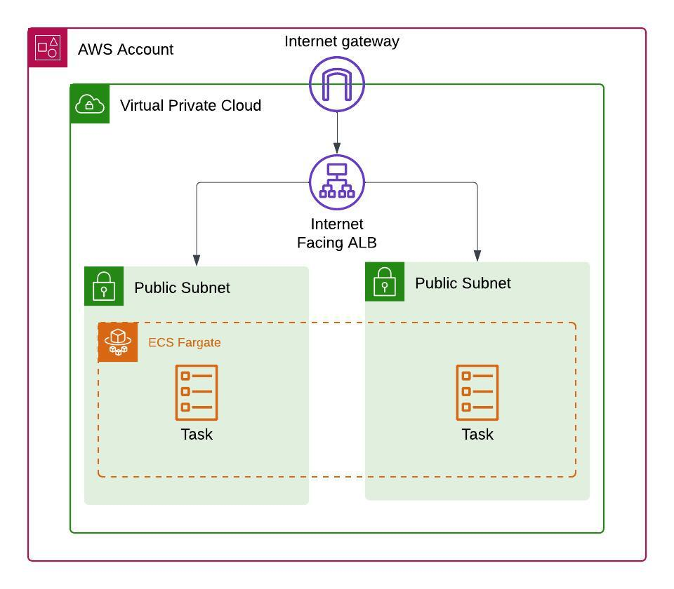
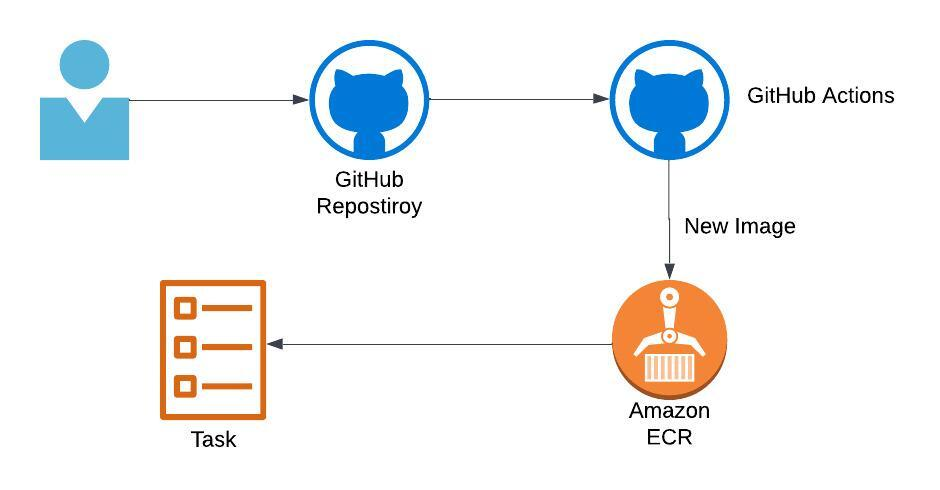

# colors-app

This project is a simple Flask application that renders a webpage with a background color.

## Architecture
This AWS-based architecture leverages key components such as VPC, Internet Gateway, ALB, Fargate, and Task Definitions to provide a highly available, scalable, and secure environment for running containerized applications. The combination of public subnets, load balancing, and container orchestration via Fargate ensures efficient handling of traffic and system performance.



## Prerequisites

- Docker installed on your machine. You can download and install Docker from [here](https://www.docker.com/get-started).
- Terraform installed on your machine. You can download and install Terraform from [here](https://developer.hashicorp.com/terraform/tutorials/aws-get-started/install-cli).

## Running the app with Docker

### 1. Build the Docker image

To build the Docker image for the app, run the following command from the project root directory (where the `Dockerfile` is located):

```bash
docker build -t app:v1 .
```

### 2. Test app locally

To test the Docker image locally, run the following command:

```bash
docker run -d -p 5000:5000 app:v1
```

From the browser:

```
http://localhost:5000
```

## Provision infrastructure locally using Terraform

### Make sure that the working directory is terraform folder

run the following commands:

```bash
export AWS_ACCESS_KEY_ID=${AWS_ACCESS_KEY_ID}
export AWS_SECRET_ACCESS_KEY=${AWS_SECRET_ACCESS_KEY}
export AWS_DEFAULT_REGION=eu-central-1
```

```bash
terraform init
terraform plan
terraform apply
```

## GitHub Actions: Build, Push Docker Image to ECR and Terraform Validation and Apply

This repository uses GitHub Actions to automate the following processes:

1. **Build and push Docker image to Amazon ECR**
2. **Run Terraform `fmt` and `validate`**
3. **Run Terraform `plan` and `apply`**

### Workflow Overview
The CI pipeline is defined in `.github/workflows/ci-steps.yml` and consists of two jobs:

1. **Build and Push Docker Image to ECR**: Builds a Docker image from the repository's `Dockerfile` and pushes it to Amazon ECR.
2. **Terraform fmt and validate**: Ensures that the Terraform configuration files are properly formatted and valid.



The CD pipeline is defined in `.github/workflows/cd-steps.yml` and consists of two jobs:

1. **Terraform plan**: Generates the Terraform execution plan to review infrastructure changes.
2. **Terraform apply**: Applies the Terraform changes to the AWS environment once the plan is approved.